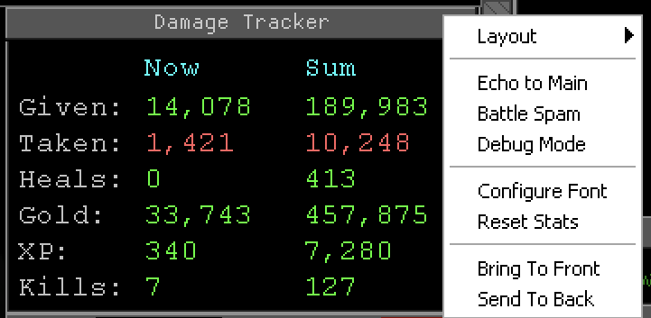

# Damage Tracker for Aardwolf MUD

A MUSHclient plugin that tracks combat statistics in real-time, displaying them in a compact miniwindow.

## Features

- **Real-time tracking** of damage given, damage taken, healing, gold, experience, and kills
- **Live display** with 1-second resolution updates
- **Rolling window** showing stats from the last N rounds (configurable, default 20 rounds)
- **Session totals** accumulated since plugin load
- **Three display layouts** to fit your screen setup
- **Combat spam control** to hide dodge/parry/skill effect messages
- **Draggable and resizable** miniwindow

## Installation

1. Download the entire `aardwolf_damage_window` repository as a folder
2. Place it in your MUSHclient `worlds/plugins/` directory
3. In MUSHclient: **File > Plugins > Add**
4. Navigate to the folder and select `aardwolf_damage_window.xml`
5. The tracker window will appear and begin tracking immediately

## Commands

All commands use the `dt` prefix:

| Command | Description |
|---------|-------------|
| `dt` | Show help |
| `dt status` | Show current settings and session totals |
| `dt show` | Show the tracker window |
| `dt hide` | Hide the tracker window |
| `dt reset` | Reset all stats to zero |
| `dt rounds <n>` | Set rounds to track (1-300, each round = 3 seconds) |
| `dt layout <mode>` | Change display layout (see below) |
| `dt echo [on\|off]` | Toggle showing tracked lines in main window |
| `dt battlespam [on\|off]` | Toggle combat effect messages (dodges, parries, etc.) |
| `dt summary [on\|off]` | Toggle round summary output to main window |
| `dt debug [on\|off]` | Toggle debug mode |
| `dt reload` | Reload the plugin |

## Display Layouts

Switch layouts with `dt layout <mode>` or right-click the window:

### Tabular (default)
Two-column format with "Now" and "Sum" headers. Best for quick comparison of current vs. total stats.

### Compact
Slash format displaying "now / sum" per stat. Smaller footprint for limited screen space.

### Classic
Original two-section vertical layout with "Last Round" and "Last N Rounds" sections.

## Understanding the Display

- **Now**: Live stats from the last 3 seconds (current combat round)
- **Sum**: Rolling total of stats from the last N rounds (default: 20 rounds = 60 seconds)

### Stats Tracked

| Stat | Description |
|------|-------------|
| Given | Damage you dealt to enemies |
| Taken | Damage you received |
| Heals | HP restored from potions, spells, and magic touch |
| Gold | Gold from corpses, splits, and sacrifices |
| XP | Experience gained (including bonuses) |
| Kills | Number of mobs killed |

## Right-Click Menu

Right-click the window title bar for quick access to:
- Layout selection
- Echo/Battlespam/Debug toggles
- Font configuration
- Reset stats
- Window z-order controls

## Tips

- Use `dt battlespam off` to reduce screen clutter during combat
- Adjust `dt rounds` to track longer or shorter combat sessions
- Use `dt status` to see both rolling totals and session totals
- The window position, size, and settings are saved between sessions

## Requirements

- MUSHclient 4.73 or higher
- Aardwolf MUD GMCP handler plugin (included with standard Aardwolf client package)

## Credits

Based on the Spam Reduce Combine plugin by Sath from the [AardwolfPlugins](https://github.com/SethBling/AardwolfPlugins) repository.